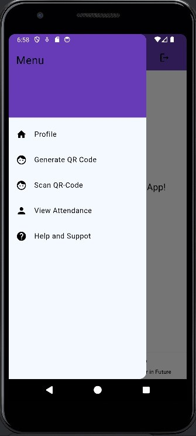

# QR-Attendance-App-in-Flutter

## About the App
QR-Attendance-App is a Flutter application that uses QR codes to manage student attendance efficiently. Developed during an Android App Development course, this app leverages Firebase Firestore for backend services.

## Features
- **QR Code Scanning:** Allows teachers to scan QR codes for marking attendance.
- **Location Restriction:** Reduces proxies by ensuring attendance can only be marked within a specified location.
- **Timer Functionality:** Adds a time constraint for marking attendance for students.

## Learnings
Through this project, I gained experience with:
- Flutter development and UI design
- Implementing Splash Screens
- Data transfer between screens
- Firebase authentication and Firestore as a backend service
- Creating Login and Signup pages along with their validations.
- CRUD operations (Teacher can perform these on the student record)

## Usage
1. **Teacher Login:** Teachers need to log in using their credentials.
2. **Generate QR Code:** Generate a unique QR code for each class session.
3. **Scan QR Code:** Students scan the QR code to mark their attendance.
4. **View Attendance:** Teachers can view and manage attendance records through the app.
#Outputs

## Contributing
Contributions are welcome! Please fork the repository and create a pull request with your changes.

## Contact
For any questions or feedback, please contact [Your Name] at [your email].
